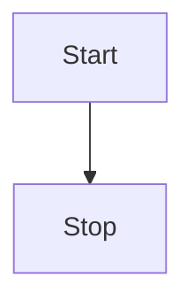

# Aether website and user documentation

This is the website and user documentation for the Aether project.

## I just want to contribute to the documentation!

Look no further! Just edit the files in the `content/docs` directory and submit a pull request.

The docs are written in GitHub Flavored Markdown (GFM) and processed by Fumadocs.
You can find more information about writing GFM style Markdown in the [Fumadocs documentation](https://fumadocs.dev/docs/ui/markdown).

**Important:** Please use [custom anchors](https://fumadocs.dev/docs/ui/markdown#custom-anchor) for headings to guarantee links stay stable in the future.

Additionally, if you want your documentation to be extra fancy, you can use [Fumadocs components](https://fumadocs.dev/docs/ui/components).

We also added custom components for advanced use cases:

### [Mermaid](https://mermaid.js.org/)

````markdown
# Just write Mermaid code between the ```mermaid tags.


````

## Development

Install `bun`:
```bash
# macOS and linux
curl -fsSL https://bun.sh/install | bash

# windows
powershell -c "irm bun.sh/install.ps1 | iex"
```

Install dependencies:
```bash
bun install
```

Start the development server:
```bash
bun dev
```
