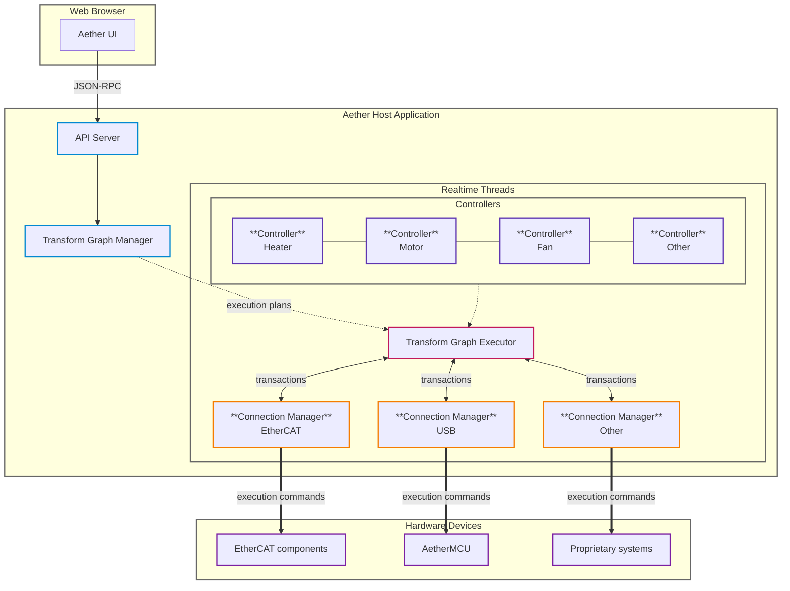

import { Callout } from "fumadocs-ui/components/callout";
import { Cards, Card } from "fumadocs-ui/components/card";

import { Showcases, Showcase } from "@/components/mdx/Showcase";

import {
  CpuIcon,
  GaugeIcon,
  LayersIcon,
  LightbulbIcon,
  NetworkIcon,  
  PackageOpenIcon,
  RadarIcon,
  RocketIcon,
  TimerIcon,
  BoxesIcon,
} from "lucide-react";

<Callout type="warning">
  ### This documentation is in its very early stages. [!toc] [#alpha-warning]
  We are still working on the alpha release of Aether. 
  Expect things to change and break frequently as we continue to develop the project.
</Callout>

## Overview [#overview]

Aether is the Rust-native framework for high-performance motion control. It blends composable crates with a host runtime that synchronizes real-time workloads across heterogeneous devices. The same building blocks power domain solutions like Aether Printer while remaining reusable in other robotics and motion control contexts.

<Showcases cols={2}>
  <Showcase title="Composable building blocks" icon={<LayersIcon />}>
    Compose libraries into turnkey applications or adopt the parts you need inside existing controllers — no heavy framework baggage required.
  </Showcase>

  <Showcase title="Unified fieldbus orchestration" icon={<NetworkIcon />}>
    Blend EtherCAT devices, Mesa cards, and custom AetherMCU boards into one cohorent system without compromising on determinism.
  </Showcase>

  <Showcase title="Determinism by design" icon={<GaugeIcon />}>
    Keep tight real-time loops on budget with zero-added overhead so planners, controllers, and the hard real-time core stay perfectly in lockstep.
  </Showcase>
</Showcases>

## Goals [#goals]

<Cards>
  <Card title="Mission-first motion" icon={<RocketIcon />}>
    Make Aether the obvious choice for robot motion control and the modern, Rust-native successor to LinuxCNC—with EtherCAT support baked in from day one.
  </Card>

  <Card title="Real-time confidence" icon={<TimerIcon />}>
    Meet hard EtherCAT cycle times while higher-level logic stays responsive, thanks to zero-copy, low-overhead interfaces between the controller and the real-time core.
  </Card>

  <Card title="Composable Rust surface" icon={<BoxesIcon />}>
    Ship modular crates with stable APIs and compile-time enforced versioning so integrators can mix capabilities and evolve systems without breakage.
  </Card>

  <Card title="Discoverable and observable" icon={<RadarIcon />}>
    Lean on well-defined device descriptors for quick configuration and record the metrics needed to replay motion paths and machine state with precision.
  </Card>
</Cards>

## Architecture [#architecture]

### Core and Controller

Aether splits the world into a hard real‑time core and a soft real‑time controller. The core keeps tight cycles, executing motion schedules and device I/O without missing its budget. The controller prepares and feeds work into the core; if it hiccups, the core pauses at the next boundary and waits for fresh commands instead of jittering. We prefer linking controller and core in‑process in Rust to skip serialization and share data directly—lower latency, higher determinism.

### Planner and Motion Queues

The planner digests long programs like G‑code, applies machine limits, and emits motion segments. Those segments stream into motion queues that the core executes; the core marks what’s already committed so the planner knows exactly how much room it has to replan. Control modes—like a position follower—sample from these queues in real time, and the planner can update or replace upcoming segments without disturbing what’s already in flight.

### Interfaces and Versioning

Interfaces are thin intentionally and we keep controller↔core calls in‑process to get compile‑time guarantees and near‑zero overhead. When we truly need a boundary, we add explicit serialization behind a stable external interface and stop there. The controller surface stays slim enough to wrap from Python (PyO3) or C (FFI) without poking holes in the real‑time envelope.

### Scope and Discoverability

We keep the hard real‑time path intentionally narrow: EtherCAT in, EtherCAT out. Everything that isn’t time‑critical—configuration, supervision, UI—lives on the controller side where it can breathe. Devices describe themselves with EtherCAT XML; when that’s not enough, we layer higher‑level descriptors so the UI can recognize what’s attached, surface capabilities, and map hardware functions.

### High‑Level Diagram [#high-level-diagram]

## Hardware & Protocols [#hardware-protocols]

<Cards>
  <Card title="Device Model" icon={<LightbulbIcon />}>
    - Treat microcontroller nodes like EtherCAT devices.
    - Use a register‑based protocol for MCUs to align with established fieldbus patterns and support protocol evolution.
  </Card>

  <Card title="Boards and Drivers" icon={<CpuIcon />}>
    - Focus on a curated set of BSPs (e.g., BTT Kraken, then Octopus) rather than a large hardware matrix.
    - Prefer driver “direct mode” where possible; use very high effective microstepping on the device while keeping host communication compact.
  </Card>
 
  <Card title="Packaging and Updates" icon={<PackageOpenIcon />}>
    - Aether Printer is distributable as a packaged binary.
    - MCU updates depend on the platform (e.g., DFU on some boards; some EtherCAT devices may not be updated in the field).
    - Minimize firmware churn by decoupling host releases from MCU firmware where feasible.
  </Card>
</Cards>

## What you can build [#what-you-can-build]

Aether is a launchpad for motion‑centric projects—from hobby robots to production‑grade machines. Pick a lane and build.

<Cards>
  <Card title="3D printers with precision and insight" icon={<LayersIcon />}>
    Run multi‑axis printers at high control rates with Aether Printer. Direct‑mode drivers deliver ultra‑fine steps, and deterministic logs preserve exact print states for confident debugging.
  </Card>

  <Card title="Robotics, CNC, and pick‑and‑place" icon={<CpuIcon />}>
    Compose planners and control modes for arms, gantries, routers, and pick‑and‑place. Replan from sensors or vision in real time—the core keeps hard timing while the controller handles iterative logic.
  </Card>
</Cards>

## Where it fits [#where-it-fits]

Aether slots in as the motion‑control substrate for robots and machines that need deterministic timing, EtherCAT networking, and modular building blocks. In 3D printing, Aether Printer bundles those pieces into an end‑to‑end firmware. When you need to meet other ecosystems halfway, bridge at the real‑time edge—without twisting the core architecture.

## What Aether is Not [#what-aether-is-not]

Here’s the short version: Aether favors openness and a Rust‑first surface. Devices are discoverable and configurable without tying MCU firmware updates to host releases. The early limited scope is intentional—a curated BSP set, not a promise to run on every board. We optimize for predictable, high‑performance hardware compositions rather than maximal MCU flexibility. Releases follow readiness and correctness, not the calendar.
